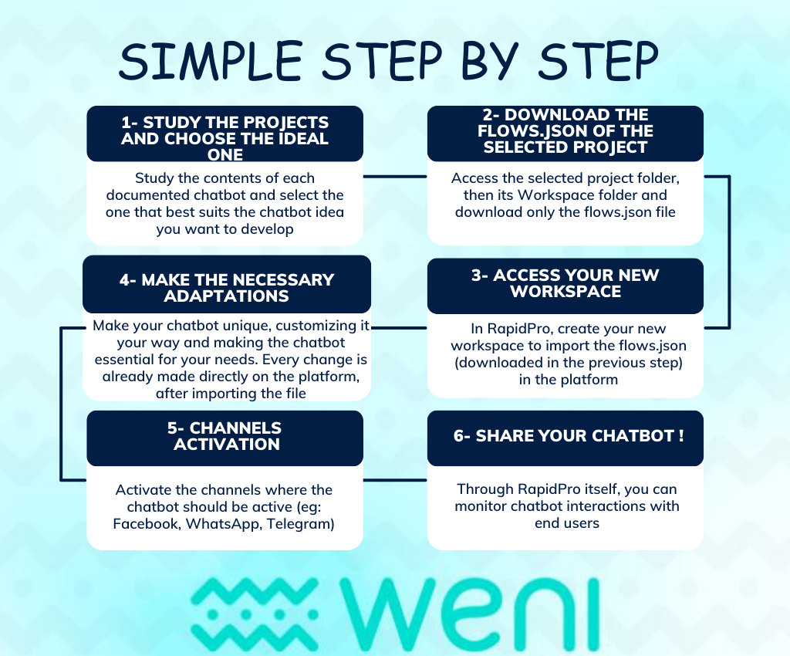
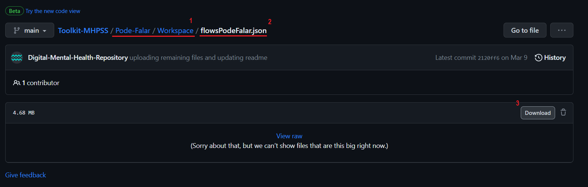
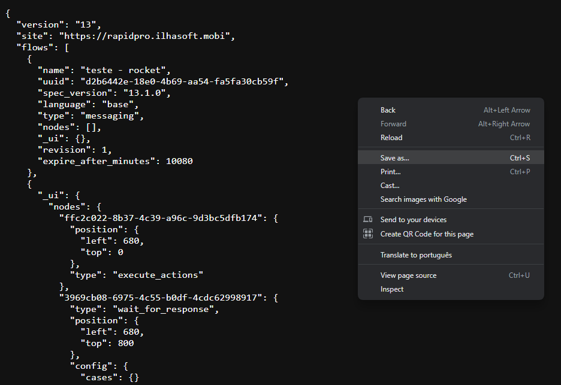
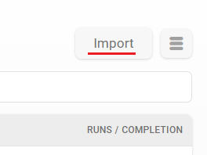
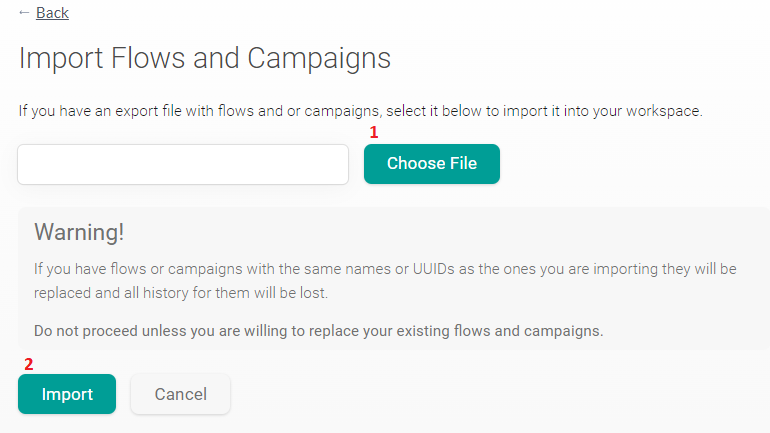
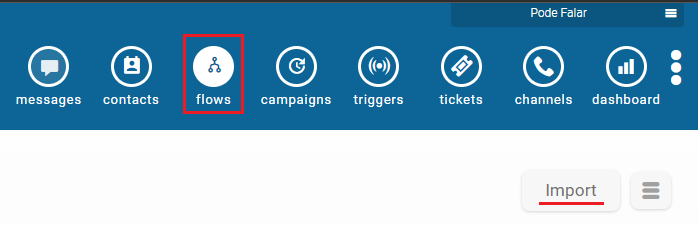
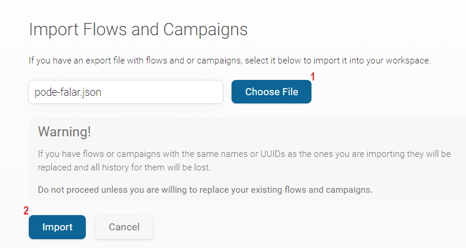

# What is this repository?

> This repository contains files that constitute the Esaro, Pode Falar, Nepal, U-Matter and UNICEF On My Mind activations projects, that are separated into three folders which are described in more detail below.

## All files are in JSON. What is JSON?

> JSON stands for JavaScript Object Notation and it's a lightweight format for storing and transporting data. JSON is "self-describing" and easy to understand.
When you import it, you will be able to remove any components that do not make sense for your specific use case.

## What is UUID?

> UUID stands for Universally Unique Identifier. It is a unique identifier that is used to identify contacts, flows, and other elements within the project.

## What does each file report?

**Workspace folder:**
> The 'Workspace' folder includes specifications, configurations, and the foundation that forms the flows of the project's components.

+ **channels.json**: name of activated channels and their corresponding UUID and creation date;

+ **contacts.json**: UUID of the contact, urns, groups the contact belongs and all their contact fields filled in;

+ **flows.json**: structured flows with their respective contents and settings;

+ **globals.json**: global variables and their values;

+ **groups.json**: UUID of al the existing groups and its name, conditional query (only for Smart Groups) and number of users belonging to it;

+ **labels.json**: UUID of the label and its name, along with the number of occurrences;

+ **template.json**: Template Message UUID and its name, the configured language, its namespace, status and the channel in which it was activated.
	
**Artificial Intelligence folder:**
> The 'AI' folder provides information about the artificial intelligence used, along with their respective datasets.

+ Contains the number of trained phrases, text of the phrases, their intentions, language, and date of creation for each AI used in the projects.  

**Contents folder:**
> The 'Contents' folder holds an excel spreadsheet, with the contents sent by the chatbot, separated into tabs.

+ **Esaro contents**
  + General Texts, Mental Health, Stress/Anxiety and Relationships;
+ **Pode Falar contents (in Portuguese)**
  + Introductory, Contents, Human service, Depositions, Idleness and Closing;
+ **Nepal contents**
  + Front screen, General Texts, Keeping up our mental health, See how are you feeling today, Tollfree numbers for support and Triggering words;
+ **U-Matter contents**
  + Menu, Welcome, Quiz, Opt in, Help;
+ **UNICEF On My Mind activations contents**
  + Emotional Regulation, Mental Health Literacy, Relationship Skills, Stress Management.

# How to download the files?

1. Go to the "Wokspace" folder of the Project you wish to download;
2. Click on the "flows.json" file;
3. Click on the option "Download":

4. Then right-click anywhere and select 'Save As':

Make sure that the name and extension (.json) of the file are correct, and you are done!

# How to import Workspace files in Dash platform?

> Please note that when importing the Flows JSON file, the **entire file contents** will be imported. At this stage, it's not possible to selectively choose which flows to import. Once the import process is complete, you can either delete any unwanted flows or archive them for future reference, keeping only what interests you.

To add a project to your workspace, you won't need any tools. Just import the **flows.json** file of your desired project, into your workspace. To do so, log in to the [Dash](https://dash.weni.ai/) platform and navigate to the desired Workspace. If you have not created one yet, please follow [these instructions](https://docs.weni.ai/l/en/getting-started/first-steps-creating-your-project).
 Then, in the **Flows** tab, click on **Import** located in the right-hand corner:

Select the file you **want to upload**¹ and then click on the **Import** button²:

Please wait a few moments, and soon the files will have been imported.

> Pay attention to the warning above! Check the flows names before importing if you don't want them to be overwritten.

# How to import Workspace files in RapidPro platform?

In the **Flows** tab, click on **Import** located in the right-hand corner:

Select the file you **want to upload**¹ and then click on the **Import** button²:

Please wait a few moments, and soon the files will have been imported.

> Pay attention to the warning above! Check the flows names before importing if you don't want them to be overwritten.

## What will be imported?
+ Flows and their contents;
+ Groups;
+ Smart Groups;
+ Contact Fields;
+ Triggers;
+ Campaigns.

## What will not be imported?
These will need to be configured manually:
+ Filling in **Globals**, if any;
+ **Artificial Intelligences** integrations;
+ Reconnect the **Integrated Channels**;
+ Import the **contact database**.
